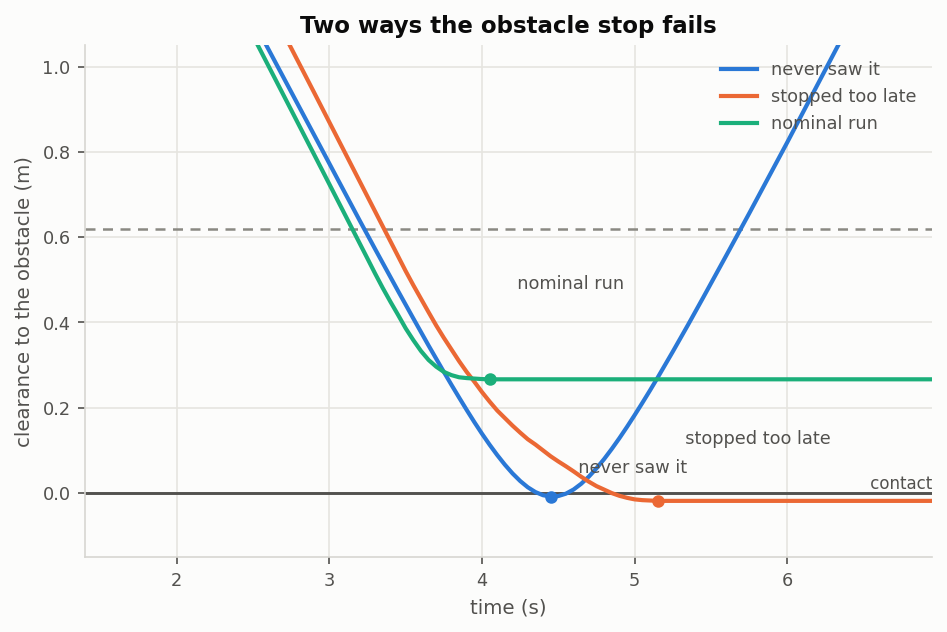
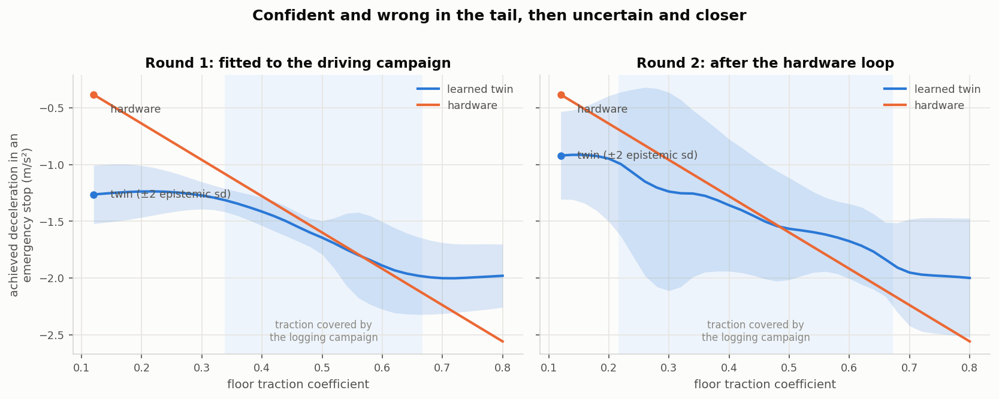
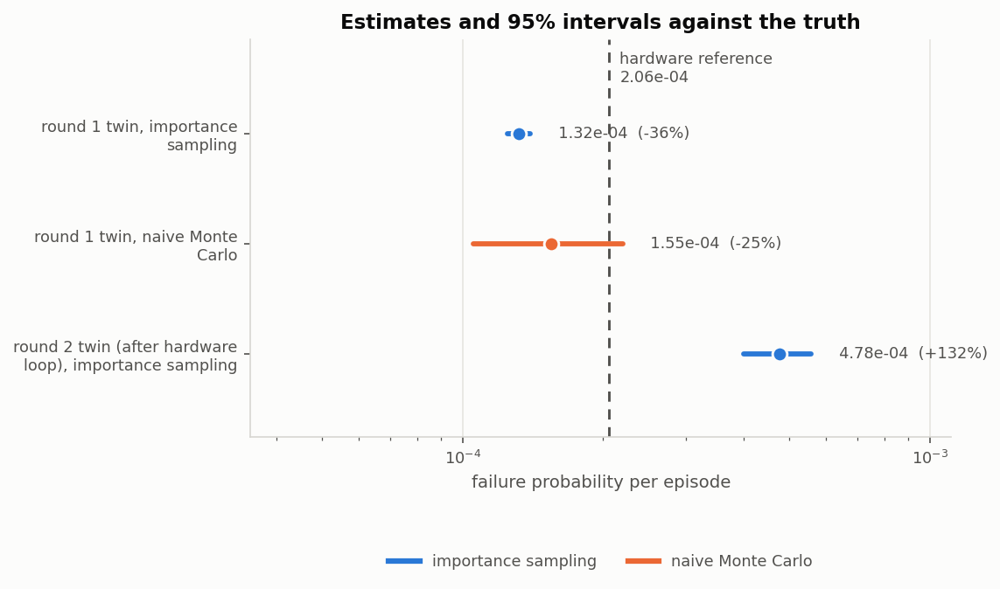

# Rare-event safety validation with a learned digital twin

**How do you estimate, with statistical confidence, the probability that a
safety function fails — when failures are too rare to observe by testing?**

A mobile robot's obstacle-stop function fails roughly once in 5,000 runs. You
will never see that in 50 test runs, or in 500. This repository is a complete,
runnable study of the standard answer: build a probabilistic model of the robot
from logged driving, search it for the *most likely* ways the function fails,
use those to build an importance-sampling estimator with real confidence bounds,
and then put the predicted failures back on the hardware to find out whether the
model was telling the truth.

Everything runs from one command on a CPU, with no dependencies beyond NumPy,
SciPy, Matplotlib and PyYAML.

```bash
pip install -e .
rsv all --config configs/default.yaml --out results
```

Results land in `results/summary.md` and `results/figures/`.

---

## The system under test

A differential-drive robot cruises toward a goal at 0.7 m/s. A forward-facing
range finder watches for obstacles; when the measured clearance drops below
0.62 m a monitor latches an emergency stop. The safety property is that the
body never touches the obstacle.

It fails in two genuinely different ways, and both matter:

| | mechanism | what it looks like |
|---|---|---|
| **Stopped too late** | the floor is slipperier than the monitor's margin assumes, and stale or biased range readings delay the trigger | the robot brakes, slides, and touches the obstacle at low speed |
| **Never saw it** | the obstacle sits far enough to the side to fall outside the beam at close range, but still inside the body's reach | the robot drives past at full cruise speed and clips it |



They live in opposite corners of the disturbance space, which is why several
pieces below exist in the form they do: a unimodal search finds one and silently
loses the other.

## Method

### 1. Everything is a standard normal

A scenario is a latent vector `z ~ N(0, I)` in 566 dimensions
(`rsv/scenario.py`). Floor traction, obstacle placement, range-finder bias and
actuation latency are static channels; range noise, dropped readings and the
per-step dynamics residual are per-step channels. Discrete quantities come from
an inverse CDF on `Φ(z)`.

This is not cosmetic. It makes `log p(z)` analytic, so importance weights are
exact rather than estimated; it makes "the most likely failure" mean exactly
`argmax -‖z‖²/2 subject to collision`; and it lets a scenario found in
simulation be replayed on hardware with the *same* disturbance realisation.

### 2. A learned twin, not a hand-tuned simulator

The robot drives 140 logged missions — ordinary transport runs plus deliberate
emergency-brake tests — and three streams are recorded: the commands sent, wheel
odometry, and pose from an overhead ArUco camera (`rsv/data.py`).

The twin (`rsv/twin.py`) is a deep ensemble of small networks with
heteroscedastic Gaussian heads, fitted to the camera-derived motion. It reports
two uncertainties and the pipeline uses them differently: **aleatoric** noise is
part of the probability space and gets sampled, while **epistemic** disagreement
between ensemble members is a warning that the estimate is not to be trusted
there.

Three details that decide whether it works at all:

* **Fitted to the camera, not the encoders.** Wheel odometry is far more precise
  overall but biased by an order of magnitude more while the wheels skid — which
  is precisely the regime the safety case turns on. `estimator_comparison`
  quantifies this on the run's own logs.
* **β-NLL, not plain NLL** (Seitzer et al. 2022). A plain Gaussian likelihood
  lets a network dismiss any region it finds hard as "noisy" and stop fitting
  the mean there. Here the hard region *is* the emergency stop.
* **Measurement noise is subtracted before simulating.** The learned variance is
  process noise plus camera noise; only the first belongs in a rollout. The
  estimator's own noise is measured without ever touching ground truth, by
  re-injecting an independent draw of the calibrated sensor noise and re-running
  the estimator.

The twin ends up accurate on the floors that were logged and **confidently
optimistic** outside them — which is the honest situation any learned model is
in, and exactly what the closing loop exists to catch.

(An exact-GP backend is available too, `--set twin.backend=gp`. It gives a
textbook-clean split of the two uncertainties and is useful as a calibration
cross-check; the ensemble is the default because it stays cheap inside a
200,000-episode Monte Carlo.)



### 3. Adaptive stress testing

Two searchers, for two different jobs (`rsv/ast/`).

**MCTS**, in the formulation of Lee, Kochenderfer and colleagues: the tree's
actions are disturbances and its reward is `Σ log p(action)` plus a terminal
miss-distance penalty, so it maximises the *likelihood* of a failure rather than
just finding one. It returns interpretable most-likely failure paths. Each node
is evaluated with a batch of independent futures, which both amortises NumPy
overhead and cuts the variance of the node value.

**Cross-entropy**, for shape rather than paths: cheap, batched, and it maps a
mode rather than finding one route into it. Restarts are seeded by pushing each
static disturbance channel into each tail in turn.

One tuning point worth stating, because getting it wrong looks like the method
failing rather than the settings: the MCTS root chooses the episode's *static*
disturbances, and those decide whether a failure is reachable at all. With the
per-level progressive-widening constant it acquires about seventy candidates
over a full search, and the lateral failure mode occupies a band roughly 1% of
that sampling distribution wide — so the search found it zero times. The root
gets its own, much wider budget; every other level is unchanged.

### 4. Importance sampling with bounds you can defend

The estimator is `p̂ = mean(w · 1[failure])` with `w = p(z)/q(z)`
(`rsv/estimate/`). Four things stand between that formula and a number worth
believing:

* **Dimension screening.** Fitting a diagonal Gaussian to failures shifts and
  shrinks all 566 coordinates by whatever sampling noise is in them; shrinking
  the standard deviation to 0.45 everywhere moves `log q` by ~450 nats and the
  weights underflow. Coordinates are soft-thresholded against their own standard
  error, so only those carrying signal are tilted.
* **Mixture, clustered in the right subspace.** k-means on raw 566-dimensional
  latents returns arbitrary groups, because the ~540 irrelevant coordinates
  contribute a common distance that swamps the modes. Clustering runs in the
  subspace where the failures actually differ — scored on mean *and* variance,
  because a symmetric mode has no mean shift at all.
* **Adaptive rounds with pooled weights.** The failures a search returns are not
  a sample from `p(z|failure)`; they come from wherever the search drifted.
  They only aim the first proposal. Later rounds draw from proposals of known
  density, pool across rounds under the balance heuristic, and refit.
* **Defensive, plus standing single-factor components.** A fraction of the
  proposal is the nominal law, which bounds every weight by `1/α` and makes the
  variance finite by construction. Alongside it sit components that push each
  static channel into each tail — because *searching* for a mode is not the same
  as *covering* it.

That last point was found the hard way, and it is the most transferable lesson
here. An early version reported a failure probability 29% too low with a tight
confidence interval that excluded the truth, while every usual diagnostic —
effective sample size, maximum weight share, agreement with naive Monte Carlo —
looked healthy. The proposal had found the lateral mode only on one side. The
samples that would have revealed it were too rare to appear.

So the pipeline ships a **coverage audit** (`coverage_diagnostic`): the failures
from the naive Monte Carlo run are an unbiased sample of the failure region, so
each one is scored by how much better the proposal is at producing it than its
defensive component alone. A large uncovered fraction means the interval is not
to be believed however tight it looks.

And a confidence interval is not the whole story even when it is valid. It
measures how precisely the integral was computed *inside the twin*. It says
nothing about how much the answer would move if the dynamics were slightly
different — and for a rare event that sensitivity is large, because a few per
cent on the achieved deceleration moves the stopping distance, then the margin,
then the tail probability. So the same estimate is also computed conditional on
each ensemble member in turn (`per_member_estimates`). That spread is much wider
than the interval, and it is the number a reviewer should read first.

### 5. Closing the loop on hardware

The most likely failures — one per mode, not the top-`n` overall, since hardware
time is the scarce resource — are replayed on the robot with the same latent
vector (`rsv/sim2real.py`). Pairing the disturbances means a disagreement is
model error rather than a different roll of the dice. Because a real floor
cannot be asked to slip on cue, each scenario is also repeated with fresh noise.

Reported alongside the validation rate: a **nominal control group**, so a high
rate cannot be an artefact of a robot that collides with everything; the
**converse check**, replaying real hardware failures in the twin to find the ones
it misses; and the twin's own epistemic uncertainty along each trajectory.

The replays are then logged through the same measurement chain as the original
campaign, appended to the training set, and the twin is refitted — a DAgger-style
correction that adds data exactly where the safety argument needs it.

The aggregation has to be done carefully, and the repository has the measurements
to show why. The scenarios worth replaying are tail scenarios, so every new row
comes from a narrow slice of the state space; replicate them 3× and the refitted
twin overestimates the failure probability by a factor of 27. Two things keep it
in hand, both of which a real campaign should do anyway: no replication (DAgger
aggregates datasets, it does not reweight them), and a *balanced* replay
campaign — twice as many nominal scenarios as predicted failures — so the added
data describes ordinary driving as well as the tail. `docs/method.md` §5.1 has
the numbers, including the residual trade that one round does not resolve.

## Results

<!-- RESULTS:START -->

From the committed run (`configs/default.yaml`, seed 20260922). Full detail in `results/summary.md`.

| | estimate | 95% interval | vs hardware |
|---|---|---|---|
| **hardware oracle** (3,000,000 episodes on the plant) | **2.06e-04** | 1.90e-04 – 2.23e-04 | — |
| naive Monte Carlo on the twin (200,000 episodes) | 1.55e-04 | 1.05e-04 – 2.20e-04 | -25% |
| importance sampling, round-1 twin (20,000 episodes) | 1.32e-04 | 1.25e-04 – 1.39e-04 | -36% |
| importance sampling, round-2 twin (after the hardware loop) | 4.78e-04 | 3.99e-04 – 5.56e-04 | +132% |

- **Variance reduction 480×.** Reaching a 10% relative error takes 757,012 episodes by naive Monte Carlo and 1,577 by importance sampling. The same 200,000-episode budget that gives the naive estimator a 74%-wide interval gives importance sampling one of 11%.
- **Coverage audit: 0% of the failure mass unreached** by the tilted components (31 naive-run failures probed). Good: the proposal reaches essentially all of the failure region.
- **The hardware failures split 57% "never saw it" / 43% "stopped too late"**, at a median traction of 0.37.
- **The hardware loop repairs the tail.** Braking-authority error outside the logged traction range: 0.48 m/s² before the loop, 0.40 m/s² after (inside the range: 0.09 → 0.18).
- **Model uncertainty dwarfs sampling uncertainty.** Re-estimating with each ensemble member in turn spans 1.16e-04 – 1.72e-04 (1.5×), against a confidence interval 11% wide. That band excludes the hardware value.
- **What the hardware loop buys is the band, not the point.** After the replays the members span 1.16e-04 – 7.99e-04 (6.9×), which contains the hardware value: a twin that has seen the tail knows it is uncertain there.
- **Sim-to-real: 35% of predicted failures reproduced on hardware** (60 replayed, 95% CI 23–48%), against 0% in the nominal control group. After the loop: 18%.
- **The twin's uncertainty is informative about its own mistakes:** predictions hardware refuted carried 24% more epistemic uncertainty than ones it confirmed (0.0038 vs 0.0031 m/s).

<!-- RESULTS:END -->

Figures shown below are copied into `docs/figures/`; a run regenerates all
eight into `results/figures/`.

| Figure | Shows |
|---|---|
| `01_twin_calibration.png` | predictive intervals against realised coverage |
| `02_braking_authority.png` | braking authority vs traction, before and after the hardware loop |
| `03_epistemic_map.png` | where in state space the twin knows it is ignorant |
| `04_failure_modes.png` | the two failure mechanisms as trajectories |
| `05_estimator_convergence.png` | estimate and interval against episodes spent |
| `06_variance_reduction.png` | episodes needed for a 10% relative error |
| `07_sim_to_real.png` | predicted margin vs measured margin on hardware |
| `08_estimates_vs_truth.png` | every estimate and interval against the oracle |



Because the "hardware" here is itself a simulator, a very large Monte Carlo on
it gives a ground truth that a real project would not have. Nothing upstream of
`stage_reference` is allowed to consult it; it exists only to score the
estimates afterwards.

## What is honest about this, and what is not

Worth being explicit, since a study that grades its own homework deserves
scrutiny:

* **The robot is simulated.** `rsv/plant.py` stands in for hardware. It is the
  only module that knows the true physics, the twin never sees it, and the
  hardware-facing interfaces are implemented for ROS 2 under `hardware/`. But
  the sim-to-real gap studied here is the gap between a learned model and a
  *known* simulator, which is a friendlier gap than the real one.
* **The gap is structural, not planted.** The twin is optimistic outside the
  logged traction range because emergency braking is traction limited and the
  logging campaign covered better floors. That is a property of the physics and
  the campaign, not a bias inserted to make the story work.
* **Learning from measured data biases the twin.** The velocity estimator
  averages over a window, so it smooths the traction limit's corner — a real
  limitation of fitting to finite-rate camera data, reported rather than
  engineered away.
* **The confidence intervals are conditional on the model.** An importance
  sampling interval computed inside the twin is a statement about the twin.
  Section 5 is what converts it into a statement about the robot, and the
  per-member spread is what says how little the interval alone is worth.
* **One round of the hardware loop does not land on the answer.** It corrects
  the *direction* of the error and repairs the twin where the replays are, but
  the replayed episodes are tail-concentrated, so refitting on them trades some
  accuracy elsewhere and the estimate overshoots rather than converging. Both
  effects are measured and reported rather than tuned away; `docs/method.md`
  §5.1 has the numbers. Iterating the loop, which a real campaign would do, is
  the missing piece.

## Repository layout

```
src/rsv/
  config.py       one typed configuration for the whole study
  scenario.py     the disturbance space and its exact density
  plant.py        ground-truth robot (the stand-in for hardware)
  controller.py   the safety function under test
  rollout.py      vectorised episodes; also the incremental stepper MCTS drives
  data.py         logging campaign, measurement chain, dataset assembly
  twin.py         the learned probabilistic twin
  models/         MLP with a heteroscedastic head, deep ensemble, GP, calibration
  ast/            MCTS adaptive stress testing; cross-entropy search
  estimate/       naive Monte Carlo, importance sampling, screening, comparison
  sim2real.py     hardware replay, scoring, and the DAgger refit
  pipeline.py     the stages; cli.py drives them
  plots.py        figures;  report.py  the written summary
tests/            72 tests, including the estimator identities
hardware/         ROS 2 recorder and scenario-runner nodes, and the data contract
configs/          default.yaml (full study), quick.yaml (faster, coarser)
scripts/          run_all.{sh,ps1}; write_configs.py; update_readme_results.py
docs/method.md    the statistical argument in more detail
```

The checked-in configs are generated from the dataclass defaults by
`scripts/write_configs.py`, and the results quoted above are spliced in from
`results/results.json` by `scripts/update_readme_results.py`. Both exist so that
what the repository claims cannot drift from what it does.

## Running it

```bash
pip install -e .            # puts the `rsv` command on your path
# ...or run it as a module from the repo root:  python -m rsv.cli ...

# the whole study
rsv all --config configs/default.yaml --out results

# faster and coarser
rsv all --config configs/quick.yaml --out results-quick

# skip the expensive oracle run (no ground truth to score against)
rsv all --skip-reference

# individual stages, resumable against artifacts already on disk
rsv collect --out results
rsv fit --out results
rsv stress --round 1 --out results
rsv estimate --round 1 --out results

# any configuration value can be overridden
rsv all --set estimate.n_mc=20000 --set twin.epochs=40

# tests (drop -m for the end-to-end ones too)
pip install -e ".[dev]" && python -m pytest -m "not slow"
```

Every stage writes a JSON artifact and reads what it needs from disk, and every
random draw comes from an independently seeded named stream, so re-running a
stage reproduces it exactly.

## References

- R. Lee et al., *Adaptive Stress Testing: Finding Likely Failure Events with
  Reinforcement Learning* (JAIR 2020); Lee et al., *Adaptive stress testing of
  airborne collision avoidance systems* (DASC 2015).
- M. Kochenderfer, *Decision Making Under Uncertainty*, ch. on rare-event
  estimation.
- R. Rubinstein and D. Kroese, *The Cross-Entropy Method*; de Boer et al., *A
  tutorial on the cross-entropy method* (2005).
- T. Hesterberg, *Weighted average importance sampling and defensive mixture
  distributions* (Technometrics 1995).
- E. Veach and L. Guibas, *Optimally combining sampling techniques for Monte
  Carlo rendering* (SIGGRAPH 1995) — the balance heuristic.
- J.-M. Cornuet et al., *Adaptive multiple importance sampling* (2012).
- B. Lakshminarayanan et al., *Simple and scalable predictive uncertainty
  estimation using deep ensembles* (NeurIPS 2017).
- M. Seitzer et al., *On the pitfalls of heteroscedastic uncertainty estimation
  with probabilistic neural networks* (ICLR 2022) — β-NLL.
- K. Chua et al., *Deep reinforcement learning in a handful of trials using
  probabilistic dynamics models* (NeurIPS 2018) — the bounded log-variance head.
- S. Ross et al., *A reduction of imitation learning and structured prediction to
  no-regret online learning* (AISTATS 2011) — DAgger.

## Licence

MIT — see `LICENSE`.
